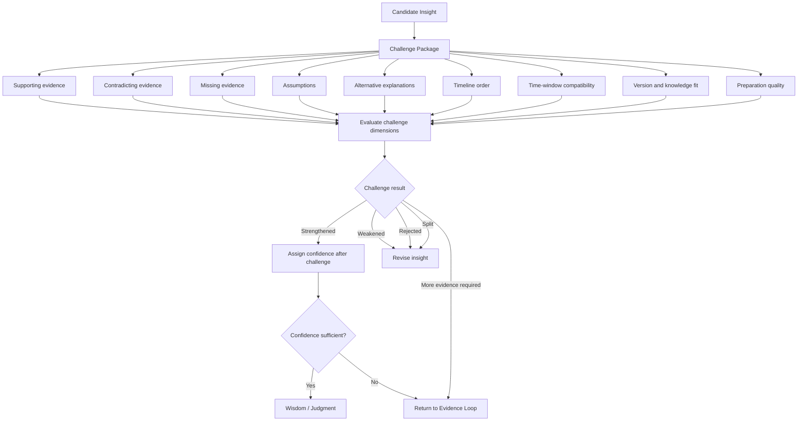

# Challenge Evaluation

**Document type:** Stage detail  
**Status:** Draft v0.5  
**Repository path:** `framework/challenge-evaluation.md`

---

## Purpose

This document defines the EGATF Challenge stage in more detail.

Challenge is the deliberate attempt to test, weaken, disprove, or qualify an insight before it influences human judgment or a decision.

The Challenge stage exists because AI-generated insights can sound plausible while being incomplete, unsupported, overconfident, or wrong.

---

## One-Line Definition

Challenge is the deliberate attempt to test, weaken, disprove, or qualify an insight before it influences judgment.

---


## Relationship to the Three-Loop Model

Challenge is the central gate of the Reasoning Loop.

```text
Information -> Knowledge -> Insight -> Challenge -> Wisdom / Judgment
```

The Challenge Confidence Gate asks:

> Has the insight survived enough challenge to become responsible judgment?

If the answer is no, the process must not continue to Decision. It must loop back to Insight, Knowledge, or the Evidence Loop.

The Challenge stage receives work from the Evidence Loop after the Evidence Sufficiency Gate has been passed. It may return work to the Evidence Loop when more evidence is required. It feeds the Action Loop only indirectly, through Wisdom / Judgment and Decision. If the Action Loop reaches the Outcome Validation Gate and the outcome contradicts the judgment, the process returns to Challenge.


## Challenge Flow



---

## Inputs to Challenge

Each insight should enter Challenge with an insight package.

| Input | Description |
|---|---|
| Insight ID | Unique identifier for the candidate insight. |
| Insight statement | The candidate explanation being tested. |
| Supporting evidence | Evidence currently believed to support the insight. |
| Information statements | Observations, timelines, comparisons, or relationships used by the insight. |
| Knowledge sources | Documentation, source code, known bugs, runbooks, or prior incidents used to interpret the evidence. |
| Assumptions | Claims required by the insight that are not yet fully proven. |
| Initial confidence | Confidence before challenge. |
| Alternatives | Other possible explanations. |

---

## Potential Challenge Questions

| Challenge question | Purpose | Possible result |
|---|---|---|
| What evidence supports this insight? | Confirms the insight is not free-standing speculation. | Strong support / weak support / no support |
| What evidence contradicts this insight? | Looks for observations that weaken or disprove the insight. | No contradiction / partial contradiction / direct contradiction |
| What evidence is missing? | Identifies what is needed to safely accept or reject the insight. | Minor gap / major gap / blocking gap |
| What assumptions does this insight depend on? | Makes hidden reasoning explicit. | Low-risk assumptions / high-risk assumptions |
| Are there alternative explanations? | Prevents tunnel vision. | No strong alternative / competing alternative / better alternative |
| Did the timeline happen in the required order? | Tests causality against event order. | Correct order / unclear order / impossible order |
| Are all evidence sources time-window compatible? | Prevents false correlations across incompatible windows. | Compatible / mixed / incompatible |
| Did guided analysis anchor the investigation too strongly? | Checks whether reported context biased the analysis. | No anchoring / possible anchoring / strong anchoring |
| Did cold analysis find anomalies guided analysis missed? | Checks for missed independent signals. | No / yes but unrelated / yes and relevant |
| Did evidence preparation hide, drop, or misclassify relevant material? | Tests preparation quality. | No issue / possible issue / clear issue |
| Did analysis confuse collection-time evidence with duration-based evidence? | Prevents support bundle timing errors. | No / possible / yes |
| Does the knowledge source apply to the relevant product version? | Prevents wrong-version reasoning. | Applies / uncertain / does not apply |
| What would we expect to see if this insight were true? | Generates predictions to test. | Expected evidence present / absent / unknown |
| What would we expect to see if this insight were false? | Tests falsifiability. | Disconfirming pattern present / absent / unknown |

---

## Challenge Evaluation Dimensions

The confidence after challenge should not be based on a single question.

Use these dimensions.

| Dimension | Low | Medium | High |
|---|---|---|---|
| Supporting evidence | Little or no direct support | Some relevant support, but incomplete | Strong direct support from reliable evidence |
| Contradicting evidence | Direct contradiction exists | Some tension or ambiguity exists | No meaningful contradiction found |
| Missing evidence | Missing evidence blocks conclusion | Some important gaps remain | Missing evidence is minor or non-blocking |
| Assumptions | Many unverified or risky assumptions | Some assumptions remain | Few assumptions, mostly verified |
| Alternatives | Better or equally strong alternative exists | Alternatives exist but weaker | Alternatives considered and less likely |
| Timeline order | Required order is wrong or unknown | Timeline partly supports insight | Timeline clearly supports insight |
| Time-window compatibility | Evidence windows are incompatible | Some mixed timing risk | Evidence windows are compatible |
| Knowledge applicability | Knowledge source does not apply | Version or context uncertain | Knowledge source clearly applies |
| Preparation quality | Tool output is unreliable or unclear | Some limitations exist | Preparation is reliable and provenance-preserving |
| Cold versus guided agreement | Guided-only finding with anchoring risk | Partial agreement | Cold and guided analysis broadly agree |

---

## Suggested Confidence Scoring

The framework can use either simple labels or a numeric score.

### Simple Label Model

Use:

```text
Low
Medium
High
```

Definitions:

| Confidence | Meaning |
|---|---|
| Low | Insight is weak, contradicted, unsupported, or dependent on missing evidence. Do not use for major decisions. |
| Medium | Insight is plausible and partially supported, but uncertainty remains. Use for cautious decisions or further investigation. |
| High | Insight is strongly supported, not meaningfully contradicted, time-compatible, version-compatible, and alternatives are weaker. |

### Numeric Support Model

Optional numeric model:

| Dimension result | Score |
|---|---:|
| Strongly negative | -2 |
| Weakly negative | -1 |
| Neutral or unknown | 0 |
| Weakly positive | +1 |
| Strongly positive | +2 |

Suggested dimensions:

1. Supporting evidence
2. Contradicting evidence
3. Missing evidence
4. Assumptions
5. Alternatives
6. Timeline order
7. Time-window compatibility
8. Knowledge applicability
9. Preparation quality
10. Cold versus guided agreement

Suggested interpretation:

| Total score | Confidence |
|---:|---|
| 12 to 20 | High |
| 5 to 11 | Medium |
| -4 to 4 | Low |
| Less than -4 | Reject or rework insight |

Important:

A single blocking contradiction can override the numeric score.

Example:

```text
If the claimed cause happened after the effect, the insight should usually be rejected or reworked even if other dimensions look positive.
```

---

## Challenge Result Types

| Result | Meaning | Next step |
|---|---|---|
| Strengthened | The insight survived challenge and confidence increased or remained acceptable. | Proceed to Wisdom / Judgment. |
| Weakened | The insight is still possible but less supported than before. | Revise the insight or collect more evidence. |
| Rejected | The insight is contradicted or unsupported enough that it should not drive decisions. | Return to Insight and consider alternatives. |
| Split | The insight combines multiple claims that need separate evaluation. | Split into smaller hypotheses and challenge each one. |
| More evidence required | The insight cannot be safely accepted or rejected with current evidence. | Return to Raw Source Material, Collection Context, or Evidence Preparation. |

---

## Challenge Confidence Table

Use this table for each challenged insight.

| Insight ID | Result | Reason | Confidence after challenge |
|---|---|---|---|
| H-001 | Strengthened / Weakened / Rejected / Split / More evidence required | | Low / Medium / High |

---

## Contradicting Evidence

| Evidence ID | Contradicts | Explanation |
|---|---|---|
| | | |

Guidance:

Contradicting evidence should be recorded even if the final judgment still accepts the insight.

The goal is not to hide uncertainty.

The goal is to make the uncertainty visible.

---

## Missing Evidence

| Missing evidence | Needed to test | Impact |
|---|---|---|
| | | |

Guidance:

Missing evidence should reduce confidence if it is required to distinguish between competing explanations.

A missing source can be a blocker if the decision would be risky without it.

---

## Challenge Summary

```text
Summarize what survived challenge and what did not.

Include:
- What evidence supported the insight.
- What evidence weakened or contradicted it.
- What evidence was missing.
- Which assumptions remained.
- Which alternatives were considered.
- Why the final challenge result was chosen.
- Why the confidence rating was assigned.
```

---

## Confidence After Challenge

Confidence after challenge should reflect the strength of the evidence chain.

It should not reflect how plausible the explanation sounds.

### High Confidence

Use High only when:

- Supporting evidence is strong.
- Contradicting evidence is absent or explained.
- Missing evidence is not blocking.
- Timeline order supports the insight.
- Evidence sources are time-window compatible.
- Knowledge sources apply to the relevant version.
- Alternative explanations are weaker.
- Preparation outputs are reliable and traceable.

### Medium Confidence

Use Medium when:

- The insight is plausible and supported.
- Some gaps remain.
- Some assumptions remain.
- Alternatives are possible but less supported.
- The decision can be cautious, reversible, or low risk.

### Low Confidence

Use Low when:

- Supporting evidence is weak.
- Important evidence is missing.
- Contradicting evidence exists.
- Timeline order is unclear or wrong.
- Evidence windows are incompatible.
- Knowledge sources may not apply.
- Anchoring risk is high.
- Preparation quality is uncertain.

---

## Blocking Conditions

A challenge should usually block progress to Judgment if any of the following are true:

- The insight has no supporting evidence.
- The claimed cause happens after the effect.
- A required evidence source is missing.
- Evidence sources are time-window incompatible.
- The insight depends on a knowledge source for the wrong version.
- A stronger alternative explanation exists.
- Derived evidence is being treated as direct evidence.
- Collection-time evidence is being used as if it represented the requested duration.
- The action resulting from the insight would be high risk and confidence is not high.

---

## Example Challenge Outcome

```text
Insight:
Tablet unavailability during the customer impact window was caused by the leaderless tablets shown in the tablet report.

Challenge:
The tablet report was collected at bundle creation time, five days after the requested log window. The collection context states that TabletReport is a collection_time_snapshot. No time-aligned tablet report is available for the customer impact window.

Result:
Weakened / More evidence required.

Confidence after challenge:
Low.

Reason:
The tablet report may be useful for current state, but it cannot safely prove tablet state during the historical log window.
```

---

## Practical Rule

An insight should not move to Judgment because it sounds right.

It should move to Judgment only after Challenge shows that it is supported, time-compatible, version-compatible, and stronger than the alternatives.
