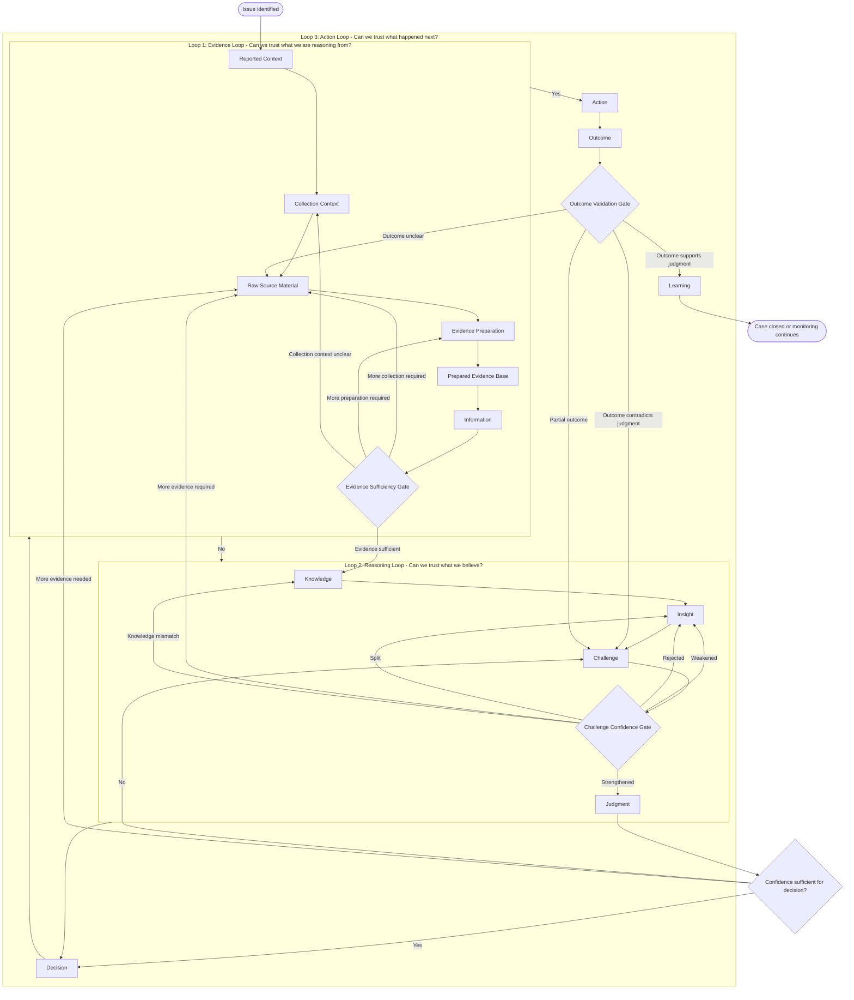

# EGATF Process Flow

**Document type:** Process overview  
**Status:** Draft v0.7  
**Repository path:** `framework/process-flow.md`

---

## Purpose

This document provides an overview of the EGATF process from issue identification through learning.

The linear chain is useful for teaching, but the practical process is three gated loops.

## Three Gated Loops

The linear chain is useful for teaching the framework, but EGATF is intended to operate as three related gated loops.

```text
Loop 1: Evidence Loop
Can we trust what we are reasoning from?

Loop 2: Reasoning Loop
Can we trust what we believe?

Loop 3: Action Loop
Can we trust what happened next?
```

The chain remains the vocabulary of the framework:

```text
Evidence -> Information -> Knowledge -> Insight -> Challenge -> Judgment -> Decision -> Action -> Outcome -> Learning
```

The three-loop model is the operating model. Each loop has a gate that can stop progression, require rework, or return the investigation to an earlier loop.

| Loop | Contains | Gate | Gate question |
|---|---|---|---|
| Evidence Loop | Reported Context, Collection Context, Raw Source Material, Evidence Preparation, Prepared Evidence Base, Information | Evidence Sufficiency Gate | Do we understand the evidence well enough to reason from it? |
| Reasoning Loop | Information, Knowledge, Insight, Challenge, Judgment | Challenge Confidence Gate | Has the insight survived enough challenge to become responsible judgment? |
| Action Loop | Decision, Action, Outcome, Learning | Outcome Validation Gate | Did the action produce the expected outcome, and what should be learned or revisited? |

Information intentionally appears at the boundary between the Evidence Loop and the Reasoning Loop. It is the point where prepared evidence becomes meaningful enough to support reasoning, but it should still stop short of diagnosis.
---

## One-Line Stage Definitions

| Stage | One-line definition |
|---|---|
| Reported Context | The unvalidated description of the issue, used as guidance but not treated as proof. |
| Collection Context | Metadata describing how the evidence package was collected, what it contains, and what time windows its contents represent. |
| Raw Source Material | The untouched diagnostic material available for analysis, such as logs, metrics, metadata, dumps, and support bundle files. |
| Evidence Preparation | The process of turning raw material into a usable evidence base through collection, transformation, parsing, normalization, indexing, extraction, derivation, and correlation. |
| Prepared Evidence Base | The prepared material available for analysis, including structured source material, extracted evidence, derived evidence, and correlated evidence. |
| Information | Meaningful observations, timelines, comparisons, and relationships derived from evidence. |
| Knowledge | Context from trusted sources such as documentation, source code, bug reports, runbooks, previous incidents, and domain expertise. |
| Insight | A candidate explanation or hypothesis produced by combining evidence, information, and knowledge. |
| Challenge | The deliberate attempt to test, weaken, disprove, or qualify an insight before it influences judgment. |
| Judgment | The current best human assessment after evidence, insight, and challenge have been considered. |
| Decision | The selected next response based on the current best judgment. |
| Action | The execution of the selected decision. |
| Outcome | The measured result of the action. |
| Learning | Reusable knowledge captured from the investigation for future use. |
---

## High-Level Three-Loop Flow



---

## Primary Gates

### Gate 1: Evidence Sufficiency Gate

Question:

> Do we understand the evidence well enough to reason from it?

This gate prevents progression when evidence is missing, misunderstood, poorly prepared, not traceable, or not time-compatible.

The gate should check:

- Reported Context has been separated into symptoms, timeline claims, component claims, and causal claims.
- Collection Context is understood, including support bundle schema, collector version, collection windows, and file index.
- Raw Source Material is sufficient for the question being asked.
- Evidence Preparation preserved provenance.
- Structured Source Material is not being confused with Extracted Evidence.
- Derived Evidence is not being treated as direct evidence.
- Collection-time snapshots are not being treated as duration-based evidence.
- A basic timeline or set of information statements can be created.

Gate outcomes:

```text
Proceed to Reasoning Loop
More collection required
More preparation required
Collection context unclear
Evidence insufficient
Evidence unsuitable for the question being asked
```

### Technique: Cold and Guided Analysis Sandboxes

Cold and guided analysis is a Reasoning Loop technique, not a gate. EGATF has exactly three gates.

Where anchoring risk matters:

- Run a cold pass without the reported cause.
- Run a guided pass with reported context as guidance, not proof.
- Compare outputs before accepting insights.

The Challenge Confidence Gate checks whether cold and guided analysis have been compared where useful.

```text
Information -> Cold and guided sandbox analysis -> Insight or Challenge
```

### Gate 2: Challenge Confidence Gate

Question:

> Has the insight survived enough challenge to become responsible judgment?

This gate prevents plausible but unsupported explanations from becoming decisions.

The gate should check:

- Supporting evidence exists.
- Contradicting evidence has been considered.
- Missing evidence is recorded.
- Assumptions are explicit.
- Alternative explanations were considered.
- Timeline order supports the insight.
- Evidence sources are time-window compatible.
- Knowledge sources apply to the relevant version.
- Cold and guided analysis have been compared where useful.
- Anchoring risk has been considered.

Gate outcomes:

```text
Strengthened: proceed to Judgment
Weakened: revise the insight
Rejected: return to alternatives
Split: break into smaller hypotheses
More evidence required: return to Evidence Loop
```

### Gate 3: Outcome Validation Gate

Question:

> Did the action produce the expected outcome, and what should be learned or revisited?

This gate prevents a wrong diagnosis from being preserved simply because an action was taken.

The gate should check:

- The action was performed as intended.
- The expected outcome occurred or did not occur.
- The outcome supports, weakens, or contradicts the judgment.
- New evidence was created by the action.
- The case should be closed, monitored, or returned to Challenge.
- Reusable learning has been captured.

Gate outcomes:

```text
Close case
Continue monitoring
Capture learning
Return to Challenge
Return to Evidence Loop
Open follow-up work
```
---

## How the Gates Prevent Wrong Diagnosis

| Failure mode | Prevented by |
|---|---|
| Customer report treated as truth | Evidence Sufficiency Gate |
| Missing bundle context | Evidence Sufficiency Gate |
| Collection-time data used as historical evidence | Evidence Sufficiency Gate and Challenge Confidence Gate |
| Structured data treated as extracted evidence | Evidence Sufficiency Gate |
| Derived evidence treated as direct evidence | Evidence Sufficiency Gate and Challenge Confidence Gate |
| Wrong documentation version used | Challenge Confidence Gate |
| Plausible AI hallucination accepted | Challenge Confidence Gate |
| Anchoring on ticket summary | Challenge Confidence Gate |
| Acting with low confidence | Decision safety check in Action Loop |
| Outcome contradicts diagnosis but gets ignored | Outcome Validation Gate |
| Same mistake repeated later | Learning stage in Action Loop |

---

## Process Design Principle

The process should not force progress just because a stage produced an answer.

Each gate asks whether the current output is good enough to move forward.

If not, the process loops backward to the earliest stage that can improve the evidence chain.
